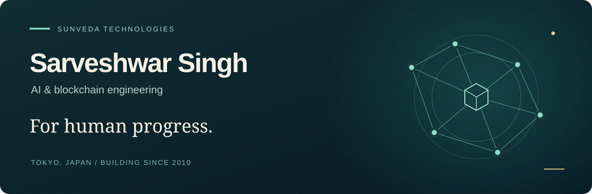

  

  <strong>15+ years building software · AI &amp; blockchain · Tokyo, Japan</strong>

  <a href="https://sunveda.tech">Portfolio &amp; collaboration</a> &nbsp; / &nbsp;
  <a href="https://sunveda.tech/app/">Explore my apps</a> &nbsp; / &nbsp;
  <a href="https://github.com/sunveda?tab=repositories">Code &amp; experiments</a>

---

### Technology should move humanity forward.

I'm **Sarveshwar Singh**, a technology consultant and hands-on engineer working through **SunVeda Technologies**. Since 2010, my work has spanned full-stack software, enterprise systems, and decentralized technology.

Today, I bring that engineering foundation to **AI applications, agent workflows, and blockchain systems**. I care about what they make possible for people: easier access to knowledge, greater control over digital assets, and useful tools for everyday life.

**My aim is simple: build technology that helps people live better, learn more, and participate with confidence.**

### Where I focus

| Applied AI | Blockchain & digital trust | Engineering for people |
| :--- | :--- | :--- |
| AI-assisted development, agent workflows, practical automation, and AI literacy. | Cardano and Ethereum ecosystems, wallet integrations, smart contracts, NFTs, and real-world asset exploration. | Accessible interfaces, multilingual experiences, privacy-conscious design, and dependable delivery. |

### Selected work

**[AEDoko — find a nearby AED](https://github.com/sunveda/aedoko)** &nbsp; · &nbsp; Public Tokyo pilot  
A mobile-first tool for finding source-listed AED locations, with multilingual access and location calculations on the device. A practical example of the work I want to do: make useful information easier to act on.  
[Try AEDoko →](https://sunveda.tech/app/aedoko)

**[SunVeda Technologies](https://github.com/sunveda/sunveda.tech)** &nbsp; · &nbsp; Live  
My multilingual consulting and portfolio site, with a growing catalogue of applications. Connecting business needs, thoughtful product design, and hands-on technical delivery.  
[Visit the portfolio →](https://sunveda.tech)

**[Codex for Everyone](https://github.com/sunveda/codex-meetup-tokyo-2026-08-07-fri)** &nbsp; · &nbsp; Community talk  
A Tokyo meetup talk and live-building demonstration exploring how non-engineers can turn natural-language ideas into useful outcomes. Part of my commitment to making AI more approachable.

**[Cardano wallet integration work](https://github.com/sunveda/yoroi-extension-ledger-bridge)** &nbsp; · &nbsp; Historical work  
A concrete part of my blockchain background: the bridge between a wallet interface and Cardano Ledger hardware-wallet integration. Preserved as an archived reference.

<strong>Explore my early-stage projects</strong>

 

- **[Familiar](https://github.com/sunveda/familiar)** — exploring parent-consented AI personalization for children's learning. Architecture and prototypes; not a production service.
- **[Health & Wellness Portal](https://github.com/sunveda/health-app)** — native iOS and Android foundations for a privacy-conscious health experience. Application shells and contracts; provider integrations are not yet connected.

### How I work

- **Start with a human need.** Let the problem determine the technology.
- **Build trust into the design.** Consider consent, privacy, security, and clear limits from the beginning.
- **Make complex systems usable.** Good engineering should reduce the burden on the person using it.
- **Share what I learn.** Through code, demonstrations, and the **今こそAI | Learn AI Now** community.

### Let's build something that matters.

I'm interested in collaboration around **useful AI, trustworthy blockchain applications, and technology with a clear human benefit**.

**[Connect through SunVeda Technologies →](https://sunveda.tech)**

---

Built with curiosity. Grounded in engineering. Guided by people.

